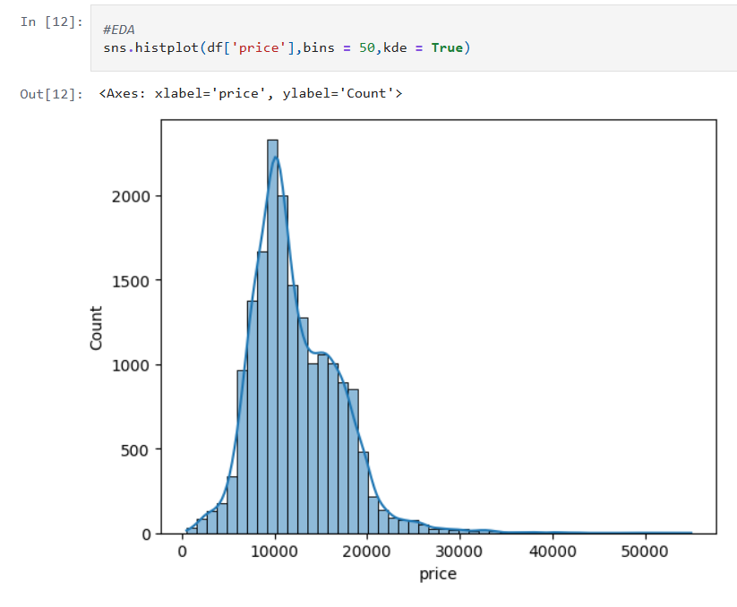
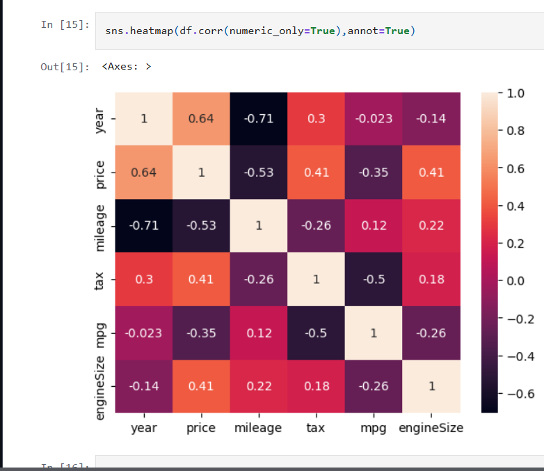
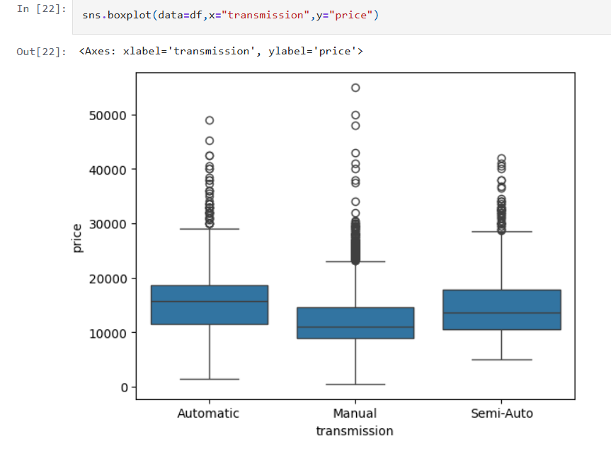

# 🚗 Ford Car Price Prediction

A Machine Learning project that predicts Ford car prices based on different vehicle features using regression techniques.

## 📌 Project Overview

The goal of this project is to build a machine learning model that can predict the price of a Ford car using features such as model, year, mileage, engine size, transmission, fuel type, tax, and MPG.

This project follows the complete Machine Learning workflow:

- Data loading
- Data cleaning
- Exploratory Data Analysis (EDA)
- Data visualization
- Feature preprocessing
- Model building
- Model evaluation
- Price prediction

## 🎯 Objectives

- Analyze the Ford car dataset
- Understand factors affecting car prices
- Perform data cleaning and preprocessing
- Conduct Exploratory Data Analysis
- Visualize important patterns and relationships
- Build regression models
- Evaluate model performance
- Predict Ford car prices

## 📊 Dataset

The dataset contains information about Ford cars and their characteristics.

### Features

- Model
- Year
- Price
- Transmission
- Mileage
- Fuel Type
- Tax
- MPG
- Engine Size

> Dataset source: Kaggle

## 🛠️ Technologies Used

- Python
- Pandas
- NumPy
- Matplotlib
- Seaborn
- Scikit-learn
- Jupyter Notebook
- Kaggle Notebook

## 🔍 Project Workflow

### 1. Data Collection

Imported the Ford car dataset and examined its structure, columns, and data types.

### 2. Data Cleaning

- Checked for missing values
- Checked duplicate records
- Examined data types
- Processed numerical features
- Processed categorical features
- Prepared the dataset for machine learning

### 3. Exploratory Data Analysis

Analyzed:

- Price distribution
- Relationship between mileage and price
- Relationship between year and price
- Effect of engine size on price
- Price differences across car models
- Impact of fuel type
- Impact of transmission type

### 4. Data Visualization

Created visualizations to understand relationships between important features.

#### Price Distribution



#### Correlation Heatmap



#### Transmission vs Price



### 5. Feature Engineering

Prepared numerical and categorical features for machine learning.

Categorical variables were converted into numerical representations where required.

### 6. Model Building

Regression algorithms were used to predict Ford car prices.

Models explored include:

- Linear Regression
- Decision Tree Regressor
- Random Forest Regressor

### 7. Model Evaluation

The models were evaluated using:

- Mean Absolute Error (MAE)
- Mean Squared Error (MSE)
- Root Mean Squared Error (RMSE)
- R² Score

## 📈 Results

The trained models were compared based on their prediction performance.

The detailed model training, evaluation metrics, and predictions are available in the Jupyter Notebook.

## 💡 Key Insights

The analysis investigates how different vehicle characteristics are related to Ford car prices.

Important factors analyzed include:

- Vehicle age
- Mileage
- Engine size
- Car model
- Fuel type
- Transmission
- MPG
- Tax

## 📁 Project Structure

```text
ford-car-price-prediction/
│
├── images/
│   ├── correlation-heatmap.png
│   ├── price-distribution.png
│   └── transmission-price-boxplot.png
│
├── ford-car-price-prediction.ipynb
├── README.md
├── requirements.txt
└── .gitignore
